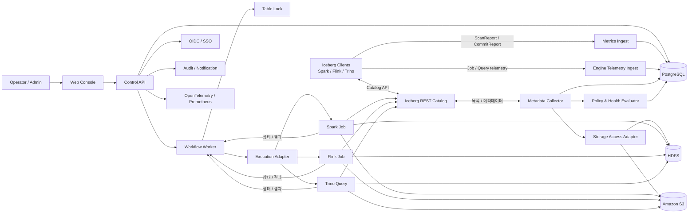
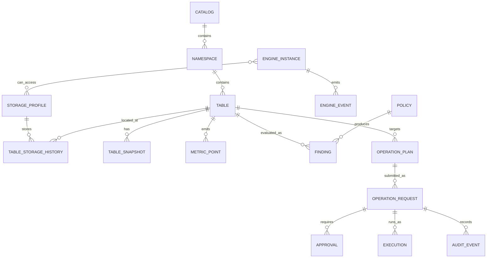

# Iceberg Ops Console 설계

> 상태: 초안(Draft)
>
> 범위: Apache Iceberg 테이블 관측, 진단, 유지보수 작업 요청/승인/실행
>
> 전제: 데이터는 현재 HDFS에 있고 향후 S3로 이전할 수 있다. Spark, Trino, Flink를 모두 지원하되 특정 엔진에 종속되지 않게 설계한다.

## 1. 한 줄 정의

Iceberg Ops Console은 여러 Iceberg Catalog의 테이블 상태를 한곳에서 관측하고, 이상 원인을 진단하며, 안전 절차를 거쳐 유지보수 작업을 실행하는 운영 Control Plane이다.

이 제품은 Iceberg REST Catalog를 대체하지 않는다. Catalog와 Iceberg 메타데이터를 사실의 원천(source of truth)으로 사용하고, 운영에 필요한 시계열 지표·정책·승인·작업 이력을 별도로 관리한다.

## 2. 목표와 비목표

### 목표

- Catalog/namespace/table 전체의 상태를 한 화면에서 파악한다.
- 작은 파일, 과도한 snapshot/delete file/manifest, 오래된 데이터 등의 문제를 조기에 발견한다.
- scan/commit 메트릭을 수집해 읽기 계획과 쓰기 품질의 변화를 추적한다.
- compaction, snapshot 만료, manifest 재작성 같은 작업을 요청·승인·실행·검증한다.
- 누가 언제 무엇을 왜 실행했는지 재현 가능한 감사 이력을 남긴다.
- Spark, Trino, Flink를 모두 연결하고 엔진별 관측·진단·작업 capability를 통합한다.
- 현재 HDFS와 향후 S3를 함께 지원하고, 저장소 이전을 감사 가능한 작업으로 수행한다.

### 비목표

- SQL 쿼리 편집기나 범용 데이터 카탈로그를 만드는 것
- 데이터 파일 내용을 읽어 전사 데이터 품질 플랫폼을 대체하는 것
- Catalog의 트랜잭션/권한/credential vending 기능을 다시 구현하는 것
- scan planning 메트릭만으로 실제 SQL 실행 시간이나 컴퓨팅 비용을 추정하는 것

## 3. 주요 사용자와 권한

| 역할 | 주요 행동 | 기본 권한 |
|---|---|---|
| Viewer | 상태, 메트릭, snapshot/schema/history 조회 | 읽기 전용 |
| Operator | 유지보수 계획 생성, 저·중위험 작업 요청 | 테이블 운영 |
| Approver | 보존/삭제/rollback 작업 승인 또는 반려 | 승인 |
| Admin | Catalog, 실행기, 정책, 권한 설정 | 관리 |
| Auditor | 작업 입력·출력·승인·실행 로그 조회 | 감사 읽기 |

권한은 역할만으로 끝내지 않고 `catalog/namespace/table` 범위와 테이블의 `owner`, `environment`, `classification` 태그를 함께 평가한다. 예를 들어 개발 namespace의 compaction은 Operator가 바로 실행할 수 있지만, 운영 PII 테이블의 snapshot 만료는 별도 Approver 승인이 필요하다.

## 4. 핵심 사용자 흐름

### 관측과 진단

1. 테이블 운영 현황에서 `Critical/Warning/Healthy/Unknown` 테이블 수와 변화량을 본다.
2. 작은 파일 증가, commit 정체, scan planning 지연 등 문제 유형으로 필터링한다.
3. Table Detail에서 snapshot/partition/file/manifest/delete-file 추이를 함께 비교한다.
4. 시스템이 문제의 근거, 영향 범위, 권장 작업과 예상 처리량을 제시한다.

### 작업 요청

1. 사용자가 테이블과 작업 종류를 선택한다.
2. 서버가 현재 snapshot을 기준으로 preflight와 dry-run/plan을 만든다.
3. 예상 대상 파일·바이트·snapshot, 예상 비용, 위험도, 실행 옵션을 표시한다.
4. 정책에 따라 즉시 실행하거나 승인을 기다린다.
5. 실행 직전 snapshot과 계획 기준 snapshot을 다시 비교한다. 달라졌다면 기존 계획을 만료시키고 재계획하며, 대상이나 위험도가 바뀌면 다시 승인받는다.
6. 실행 결과를 수집하고 메트릭을 다시 계산해 개선 여부를 검증한다.

## 5. 전체 아키텍처



### 설계 원칙

- **Control Plane과 Data Plane 분리**: 웹/API는 계획과 상태만 관리한다. 대규모 파일 스캔·rewrite는 별도 실행기에서 수행한다.
- **Catalog가 진실의 원천**: Console DB는 검색과 시계열을 위한 projection/cache이며 테이블의 정본이 아니다.
- **계획 우선**: 변경 작업은 가능한 한 plan/dry-run을 먼저 만들고 승인 입력에 그 결과를 고정한다.
- **테이블 단위 직렬화**: 동일 테이블의 상충하는 유지보수 작업은 동시에 실행하지 않는다.
- **안전한 기본값**: 삭제성 작업은 짧은 보존 기간을 금지하고, 실행 직전 precondition을 재검사한다.
- **엔진 독립 API**: UI 요청은 `REWRITE_DATA_FILES` 같은 의미 기반 명령이며 Spark SQL 문자열이 아니다.
- **저장소 독립 식별**: `hdfs://`, `s3://` 경로를 문자열 치환하지 않고 URI와 FileIO capability로 다룬다.
- **Capability 기반 라우팅**: 엔진별 지원 기능과 버전을 등록하고, 작업마다 실행 가능한 엔진만 선택한다.

## 6. 컴포넌트

### Web Console

- Catalog/namespace/table 탐색과 전역 검색
- 테이블 운영 현황과 Table Detail
- 작업 계획 비교, 요청, 승인, 취소
- 정책, 일정, 알림, 감사 로그 관리
- 기술 스택 제안: Next.js + TypeScript + React Query + ECharts

### Local Playground

- 개발·데모 전용 Compose profile로 단일 NameNode/DataNode HDFS, Spark standalone master/worker와 로컬 Livy를 제공한다.
- Spark runner는 Iceberg `HadoopCatalog`의 warehouse를 `hdfs://namenode:8020/warehouse`로 사용한다.
- `playground.demo.orders` 샘플은 format-version 2, 날짜 partition으로 생성하고 두 번 append하여 snapshot/history/metadata table을 바로 확인할 수 있게 한다.
- 웹 SQL은 읽기 전용 단일 statement와 최대 200행만 허용한다. 이는 보안 경계가 아니라 실수 방지 장치이므로 인증 없는 운영 환경에 노출하지 않는다.
- Bulk table 조회·등록은 한 요청에 최대 200개 식별자를 허용한다. 요청은 PostgreSQL 기반 `BulkJob`/`BulkJobItem`으로 비동기 처리하며 테이블별 결과와 재시작 가능한 진행 상태를 보존한다. Playground는 성공한 테이블의 공통 메트릭 비교표와 선택 테이블 상세, 테이블별 오류를 함께 표시하며 일부 실패를 전체 실패로 승격하지 않는다.
- Playground의 `operation-worker`는 등록된 HDFS Hadoop Catalog에서 작업 대상으로 명시 등록한 테이블에 실제 Spark procedure를 Livy batch로 제출하는 첫 Execution Adapter다. `FOR UPDATE SKIP LOCKED`로 큐를 점유하고 실행/검증/이벤트를 DB에 기록한다. Playground의 읽기 전용 SQL과 Iceberg metadata table 조회는 별도의 상시 Spark runner가 직접 처리한다.
- Operations Bulk 요청은 그룹 `BulkJob` 아래 테이블마다 독립된 `OperationRequest`와 audit event를 생성한다. 승인, snapshot precondition, 실행, 검증과 재시도를 독립적으로 유지하며 그룹 진행률·취소·실패 항목 재시도를 제공한다.
- 요청 시 snapshot을 계획 조건으로 고정하고 실행 직전에 실제 snapshot과 비교한다. 불일치하면 mutation 전에 실패하며 운영자가 상태를 확인하고 새 요청을 만들어야 한다.
- 승인 시 `operation_table_locks`의 테이블 PK 잠금을 획득해 같은 테이블의 활성 mutation을 직렬화한다. terminal 상태와 승인 전 취소 시 잠금을 해제한다.
- 생성 API는 payload fingerprint와 `Idempotency-Key`를 저장한다. 같은 키/같은 payload는 기존 결과를 반환하고 다른 payload 재사용은 거부한다.
- 실행 취소는 `CANCEL_REQUESTED`로 전이하고 Livy `DELETE /batches/{id}`에 전달한다. worker 재시작 시 저장된 `livy-batch:{id}`에 재연결해 상태와 결과 로그를 회수한다.
- 목록은 `(created_at, id)` cursor pagination을 사용하고 SSE는 operation/Bulk Job 변경 token을 전달한다.
- worker는 `QUEUED → RUNNING → VERIFYING → SUCCEEDED/FAILED`를 관리하고 heartbeat, attempt, Spark 출력, 전후 table state를 UI에 제공한다. 실패 작업의 재시도는 자동이 아니라 운영자의 명시적 요청으로만 수행한다.
- 현재 Playground worker는 등록된 HDFS Hadoop Catalog와 명시적으로 등록된 작업 대상 테이블만 allowlist로 소비한다. 운영 worker는 별도의 catalog scope와 외부 Livy endpoint·인증·credential 설정으로 분리한다.
- HDFS, Spark와 Livy 이미지는 폐쇄망 bundle 용량을 크게 늘리므로 빌드 시 명시적으로 선택한 bundle에만 포함한다.

### Control API

- 인증/인가, 조회 API, 요청 validation, 승인 정책 평가
- 기술 스택: Python 3.13 + FastAPI + SQLAlchemy 2의 modular monolith
- 비동기 HTTP/DB 처리를 사용하고 엔진·저장소 연동은 Python protocol 기반 adapter로 분리한다. Spark의 Iceberg Java Action이 필요한 작업은 Spark job으로 제출한다.
- 외부 공개 Iceberg REST Catalog API와 운영자용 `/ops/api/v1` API는 URL과 보안 경계를 분리한다.

### Metadata Collector

- Catalog에서 namespace/table 목록과 현재 metadata location을 증분 동기화한다.
- Iceberg metadata와 metadata table에서 snapshot, history, refs, manifests, files, partitions 정보를 수집한다.
- 기본 주기는 전체 테이블 목록 5분, 활성 테이블 1분, 비활성 테이블 15분으로 시작한다.
- commit 이벤트가 들어오면 해당 테이블을 우선 갱신해 polling 지연을 줄인다.
- 대규모 테이블의 `files` 전수 계산은 매번 수행하지 않고 snapshot 변경 시 샘플/증분 또는 실행 엔진 집계를 사용한다.

### Storage Access Adapter

Iceberg metadata에는 data file의 절대 경로가 기록되므로 HDFS와 S3를 단순한 mount path처럼 취급하지 않는다. 저장소 연결 정보를 `StorageProfile`로 관리하고 Iceberg `FileIO`를 통해 접근한다.

```text
StorageProfile
  id, type(HDFS|S3), uriPrefix, fileIoImpl
  configRef, credentialRef, capabilities
  region, endpoint, encryptionPolicy, status
```

- HDFS: `HadoopFileIO`, NameNode URI, `core-site.xml`/`hdfs-site.xml` reference, Kerberos principal/keytab 또는 delegation token
- S3: `S3FileIO`를 기본값으로 사용하고 region, endpoint, IAM role/STS, SSE-KMS, multipart 설정을 profile로 관리
- table의 `metadata_location`, data file URI, manifest URI는 원문을 보존하고 별도의 정규화된 scheme/authority/prefix를 검색용으로 저장
- collector와 각 engine instance가 어느 StorageProfile에 접근 가능한지 주기적으로 health check
- HDFS와 S3가 섞인 migration 기간에는 두 profile을 동시에 참조할 수 있지만 새 write 대상은 하나만 허용
- namespace별 `default_storage_profile`과 허용 prefix 정책을 두어 신규 테이블의 위치를 결정하고, client가 임의의 외부 location을 지정하지 못하게 할 수 있다.
- REST Catalog의 config/load-table 응답과 각 엔진 설정이 같은 FileIO 정책을 사용하게 하며 credential은 가능하면 단기 발급한다.

S3 지원 시 Hadoop S3A를 기본 구현으로 삼지 않는다. Iceberg의 S3 기능과 credential 처리를 일관되게 사용하기 위해 `S3FileIO`를 우선하고, 기존 `s3a://` 경로 호환이 필요한 경우에만 별도 compatibility profile을 둔다.

### Metrics Ingest

- Iceberg REST 규격의 `POST /v1/{prefix}/namespaces/{namespace}/tables/{table}/metrics`에서 `ScanReport`, `CommitReport`를 수신한다.
- 원본 payload를 validation한 뒤 표준 필드와 확장 필드를 분리 저장한다.
- `filter`, projected field name 등 민감할 수 있는 값은 기본적으로 저장하지 않거나 hash/redaction한다.
- 네트워크 재시도 중복만 제거하도록 source·payload fingerprint·짧은 retry window를 함께 사용한다. 내용이 같은 정상 scan 두 건을 하나로 합치지 않는다.
- 이 데이터는 client-side scan **planning**과 commit 지표다. 실제 query runtime, shuffle, CPU는 엔진 telemetry 연동 전에는 표시하지 않는다.

### Engine Registry & Telemetry Ingest

각 실행 환경을 `EngineInstance`로 등록한다. `type`, `version`, endpoint, auth reference, catalog alias, 접근 가능한 storage profile과 capability를 저장하고 연결 상태를 점검한다.

| 엔진 | 수집 채널 | 주요 지표 |
|---|---|---|
| Spark | Iceberg REST reports + Spark Listener/History Server 또는 OpenTelemetry | scan/commit, stage/job duration, input/shuffle bytes, executor 실패 |
| Flink | Iceberg REST reports + Flink REST/Prometheus + Iceberg sink metrics | checkpoint, flush/commit duration, data/delete file size, job restart/backpressure |
| Trino | Event Listener + OpenTelemetry/JMX + query API | planning/execution/queued time, scanned bytes/rows, split, failure, query-to-table 관계 |

- 공통 key는 `engine_type`, `engine_instance_id`, `job_or_query_id`, `table_uuid`, `snapshot_id`, `observed_at`이다.
- 엔진별 원본 event는 보존하고 공통 지표만 별도 rollup한다.
- REST metrics reports가 모든 엔진/버전에서 동일하게 발생한다고 가정하지 않는다. 누락 여부를 capability와 coverage 지표로 노출한다.
- query text와 predicate는 기본 미수집 또는 redaction하며, table lineage와 성능 집계에 필요한 식별 정보만 남긴다.

### Policy & Health Evaluator

- 수집된 사실을 운영 정책과 비교해 finding을 생성한다.
- 룰의 threshold, 지속 시간, severity, 예외, 권장 action을 버전 관리한다.
- 하나의 순간값보다 `N회 연속` 또는 `M분 지속`을 기본 조건으로 사용해 경보 진동을 줄인다.
- 테이블별 SLO profile(`streaming-hot`, `batch-daily`, `archive`)을 지원한다.

### Workflow Worker

- `PENDING -> PLANNING -> WAITING_APPROVAL -> QUEUED -> RUNNING -> VERIFYING -> SUCCEEDED/FAILED` 상태 머신과 `REJECTED/CANCELED/EXPIRED` 종료 상태를 관리한다.
- DB outbox와 `SELECT ... FOR UPDATE SKIP LOCKED` 기반 worker로 시작한다.
- 장기 실행, 보상 트랜잭션, 다단계 승인이 복잡해질 때 Temporal 같은 workflow engine 도입을 검토한다.
- 실행 중 취소는 실행기에 전달하되 이미 commit된 Iceberg 변경을 되돌린다고 약속하지 않는다.

### Execution Adapter

```text
MaintenanceExecutor
  plan(command, tableState) -> Plan
  submit(plan, credentialRef) -> ExecutionRef
  status(executionRef) -> ExecutionStatus
  cancel(executionRef) -> CancelResult
  collect(executionRef) -> ExecutionResult
```

세 엔진 어댑터를 제공한다.

- `SparkExecutor`: 현재 Apache Livy `/batches` 제출·상태 polling·로그 결과 회수를 구현하며, Spark on Kubernetes/Spark Operator나 Spark Connect는 추가 adapter로 확장
- `FlinkExecutor`: Flink REST API/Application job과 Iceberg `TableMaintenance`
- `TrinoExecutor`: 별도 service account로 Trino protocol을 사용하며 query id와 결과 metric을 수집

지원 기능은 엔진 버전에 따라 달라질 수 있으므로 연결 시 capability probe를 수행하고, 관리자가 검증된 기능만 enable한다.

현재 Livy adapter는 승인된 PySpark artifact의 HDFS 경로를 `file`로 제출하고 batch ID를 즉시 `execution.external_id`에 저장한다. Spark job은 snapshot precondition을 다시 검사하고 작은 JSON 결과를 전용 log marker로 남긴다. Worker는 terminal state 이후 이 marker를 회수해 before/after 검증과 감사 이벤트를 완성한다. Livy/Spark 장애로 worker가 재시작된 경우에는 저장된 batch ID를 먼저 조회한 뒤 재제출 여부를 판단하도록 recovery reconciliation을 확장해야 한다.

| 의미 기반 작업 | Spark | Flink | Trino | 기본 라우팅 |
|---|---|---|---|---|
| Metadata/inventory 조회 | metadata tables/API | metadata tables/API | `$files`, `$snapshots`, `$manifests` 등 | Trino, 대규모는 Spark |
| Rewrite data files | Spark action/procedure | `TableMaintenance` | `ALTER TABLE EXECUTE optimize` | batch=Spark, streaming=Flink |
| Rewrite manifests | Spark action/procedure | capability 없음 | `optimize_manifests` | Spark |
| Rewrite position deletes | Spark action/procedure | 버전별 확인 | optimize 과정에서 일부 정리 | Spark |
| Expire snapshots | Spark action/procedure | `TableMaintenance` | `expire_snapshots` | schedule owner 기준 |
| Remove orphan files | Spark action/procedure | `TableMaintenance` | `remove_orphan_files` | 별도 승인 후 Spark |
| Compute/refresh stats | Spark procedure | capability 없음 | `ANALYZE` | Trino workload는 Trino |
| HDFS→S3 path rewrite | `RewriteTablePath` 기반 | capability 없음 | capability 없음 | Spark 전용 |

표의 `capability 없음`은 플랫폼 미지원이 아니라 해당 engine adapter로 그 작업을 실행하지 않는다는 의미다. 동일 테이블에 대한 작업 owner는 하나만 두어 Spark schedule, Flink maintenance, Trino procedure가 중복 실행되지 않게 한다.

API 서버 내부 thread에서 compaction이나 orphan scan을 직접 실행하지 않는다.

## 7. 메트릭 모델

### 수집 출처

| 출처 | 얻는 정보 | 수집 방식 | 주의점 |
|---|---|---|---|
| REST Catalog/metadata | schema, spec, properties, snapshot, refs | polling + commit-triggered refresh | 정본이며 Console DB는 cache |
| Iceberg metadata tables | file/manifest/partition/delete 분포 | collector 또는 engine query | 큰 테이블 전수 조회 비용 제한 |
| REST metrics reports | scan planning, commit duration/attempt/file 변화 | push | 실제 query 실행 시간 아님 |
| Execution engine | job 상태, CPU/memory/shuffle, 실패 원인 | adapter/telemetry | 엔진별 정규화 필요 |
| HDFS/S3 | orphan 후보, 실제 저장량, 저장소별 분포 | FileIO 기반 제한적 listing | 경로 불일치와 진행 중 write 주의 |
| Console 서비스 | API latency/error, queue lag, collector lag | OpenTelemetry | Prometheus에 table id 고카디널리티 label 금지 |

### 전체 테이블/개별 테이블 핵심 지표

| 영역 | 지표 | 활용 |
|---|---|---|
| Freshness | 마지막 commit 시각, 기대 주기 대비 지연 | 수집 중단/파이프라인 이상 |
| Storage | 총 data/delete bytes, record/file 수, 증감률 | 용량/비용 추세 |
| File health | 평균/p50/p95 파일 크기, small-file count/bytes ratio | compaction 필요성 |
| Delete health | position/equality delete file·record 비율 | read amplification, delete rewrite |
| Snapshot | snapshot 수, oldest age, commits/day | expiration 정책 |
| Metadata | manifest 수/크기, metadata JSON 버전 수 | planning overhead |
| Scan planning | planning duration p50/p95, planned bytes/files, manifest/file skip ratio | pruning/metadata 품질 |
| Commit | duration p50/p95, attempts, added/removed files, operation별 빈도 | writer/충돌 상태 |
| Engine query/job | Spark stage, Flink checkpoint/backpressure, Trino planning/runtime/scanned bytes | 실제 실행 병목과 engine별 영향 |
| Storage | HDFS/S3별 active bytes/files, migration progress, mixed-path count | 이전 상태와 저장 비용 |
| Maintenance | 마지막 성공, 실행 주기, rewritten/deleted bytes, 실패율 | 자동화 신뢰도 |
| Operations | queue wait, runtime, failure reason, 재시도 | 운영 시스템 상태 |

small-file 기준은 고정 128 MB가 아니라 table property `write.target-file-size-bytes`를 우선 사용한다. 예시로 `file_size < target_size * 0.25`인 파일 비율을 계산하되, count ratio와 byte ratio를 함께 보여준다.

### Health 상태

- `Critical`: 데이터 유실 위험, freshness SLO 위반, 최근 유지보수 반복 실패 등 즉시 조치가 필요한 상태
- `Warning`: small-file/delete/manifest/snapshot 누적이 정책 임계치를 지속 초과
- `Healthy`: 적용된 SLO profile의 모든 필수 룰 통과
- `Unknown`: 수집 지연, 권한 부족, 데이터 부족으로 판단할 수 없음

단일 불투명 점수보다 상태와 finding 목록을 기본 UI로 사용한다. 정렬용 점수가 필요하면 아래처럼 계산하되 근거를 항상 노출한다.

```text
health_score = 100 - sum(active_finding.weight)
score range = [0, 100]
```

초기 룰 예시:

| 룰 | 예시 조건 | 기본 severity | 권장 작업 |
|---|---|---|---|
| freshness lag | profile 주기의 2배 초과가 10분 지속 | Critical | upstream 확인 |
| small files | count ratio 40% 초과, eligible bytes 10 GB 이상 | Warning | rewrite data files |
| delete amplification | delete record/data record 비율 20% 초과 | Warning | rewrite data/delete files |
| snapshot buildup | 30일 초과 snapshot 존재, 총 500개 초과 | Warning | expire snapshots |
| slow planning | p95가 5초 초과하며 전주 대비 2배 | Warning | manifest/partition 분석 |
| collector stale | 마지막 성공이 수집 주기의 3배 초과 | Unknown | credential/collector 확인 |

수치는 제품 기본값일 뿐이며 실제 운영 profile에 맞춰 조정해야 한다.

### 보존과 저장

- PostgreSQL을 운영 상태의 단일 저장소로 시작한다.
- raw metrics report: 14일(설정 가능), 테이블별 일자 partition
- 5분 집계: 90일, 1시간 집계: 13개월
- 작업/승인/audit: 조직 보존 정책에 따라 최소 1년 권장
- 큰 JSON은 압축 object storage로 이관할 수 있지만 DB에는 hash와 위치를 남긴다.
- Prometheus는 Console 자체 서비스 지표에 사용하며, table UUID를 label로 가진 장기 시계열 저장소로 사용하지 않는다.

## 8. 화면 정보 구조

### 1) 테이블 운영 현황

- 상태별 테이블 수, active findings, 수집 지연, 실행 중/실패 작업
- storage 증가량, small-file/delete-file 상위 테이블
- freshness 위반, scan planning 악화, commit retry 상위 테이블
- catalog/environment/owner/profile/tag 필터

### 2) Catalog Explorer

- namespace tree와 table 검색
- owner, format version, last commit, size, health, open finding 표시
- 저장된 필터와 CSV export

### 3) Table Detail

- Overview: 현재 snapshot, size/records/files, freshness, health findings
- Files & Partitions: 크기 분포, hot partition, small/delete files
- Snapshots & Refs: history, branch/tag, operation, summary, 변경량
- Schema & Properties: schema/spec/sort order/property 변경 diff
- Read & Write: scan planning/commit 시계열
- Maintenance: 권장 작업, schedule, 과거 결과와 전후 비교
- Audit: 작업, 승인, 설정 변경 이력

### 4) Operations

- 요청함, 승인함, 실행 큐, 실패/재시도
- plan과 실제 결과 비교
- 동일 작업 재실행 시 기존 옵션을 복사하되 새 snapshot으로 재계획

### 5) Policies & Settings

- SLO profile, health rules, maintenance schedule
- catalog/runner/notification 연결 상태
- RBAC/ABAC scope와 break-glass 정책

## 9. 지원 작업과 위험 등급

| 작업 | 목적 | 기본 위험 | 보호 장치 |
|---|---|---:|---|
| Compute table/partition stats | planner 통계 갱신 | 낮음 | 비용/대상 범위 제한 |
| Rewrite manifests | scan planning 개선 | 중간 | current snapshot 재검사 |
| Rewrite data files | small file compact/sort | 중간 | 대상 partition·bytes 상한, 동시성 제한 |
| Rewrite position delete files | delete read amplification 감소 | 중간 | 대상/출력 크기 계획 |
| Expire snapshots | metadata/storage 정리 | 높음 | 최소 보존일·retain-last·refs 확인·승인 |
| Remove orphan files | 미참조 파일 삭제 | 매우 높음 | dry-run, 최소 3일 이상, path 검증, 2인 승인 |
| Rollback/cherry-pick | 잘못된 commit 복구 | 매우 높음 | 영향 diff, 최신 snapshot precondition, 2인 승인 |
| Set table properties | 운영 property 변경 | 조건부 | allowlist, before/after diff |

### 공통 안전 절차

1. 입력을 typed command로 validation한다.
2. `table_uuid`, `metadata_location`, `current_snapshot_id`를 계획의 precondition으로 저장한다.
3. plan에 대상 수/바이트, 제외 대상, retention cutoff, 실행 옵션, 예상 비용을 넣는다.
4. 위험도와 정책에 따라 승인을 받는다. 요청자와 최종 승인자를 분리할 수 있다.
5. 테이블 advisory lock을 획득하고 실행 직전 precondition을 재검사한다.
6. `idempotency_key`로 중복 제출을 막고 외부 execution id를 즉시 기록한다.
7. 결과 snapshot과 action output을 수집한다.
8. collector를 즉시 재실행하고 전후 지표를 비교해 검증한다.
9. 모든 단계와 주체, 옵션, 에러를 append-only audit event로 남긴다.

특히 orphan 삭제는 진행 중인 write보다 짧은 보존 기간을 허용하면 안 된다. 경로 scheme/authority가 metadata와 실제 listing에서 다를 경우 기본 동작은 중단이다.

## 10. 운영 API 초안

```http
GET    /ops/api/v1/catalogs
GET    /ops/api/v1/tables?catalog=&namespace=&health=&owner=&cursor=
GET    /ops/api/v1/tables/{tableId}
GET    /ops/api/v1/tables/{tableId}/metrics?metric=&from=&to=&step=
GET    /ops/api/v1/tables/{tableId}/snapshots
GET    /ops/api/v1/tables/{tableId}/findings

POST   /ops/api/v1/operation-plans
GET    /ops/api/v1/operation-plans/{planId}
POST   /ops/api/v1/operation-requests
GET    /ops/api/v1/operation-requests/{requestId}
POST   /ops/api/v1/operation-requests/{requestId}/approvals
POST   /ops/api/v1/operation-requests/{requestId}/cancel

GET    /ops/api/v1/policies
POST   /ops/api/v1/policies
GET    /ops/api/v1/audit-events
```

작업 계획 요청 예시:

```json
{
  "tableId": "2ee1a4c6-...",
  "command": "REWRITE_DATA_FILES",
  "parameters": {
    "partitionPredicate": {
      "field": "event_date",
      "operator": "GTE",
      "value": "2026-08-17"
    },
    "strategy": "BINPACK",
    "targetFileSizeBytes": 536870912,
    "maxRewriteBytes": 1099511627776
  },
  "reason": "small file ratio가 63%로 증가"
}
```

서버는 UI가 전달한 catalog/table 이름을 실행 SQL에 직접 보간하지 않는다. 식별자와 구조화된 predicate를 schema/allowlist로 검증하고 실행 어댑터가 엔진별 명령으로 변환한다.

## 11. 핵심 데이터 모델



주요 엔티티:

- `catalog`: endpoint, warehouse, capability, credential reference, sync status
- `storage_profile`: HDFS/S3 type, URI prefix, FileIO/config/credential reference, encryption policy, health
- `engine_instance`: Spark/Trino/Flink type과 version, endpoint, auth, capability, storage access health
- `table`: stable internal id, Iceberg table UUID, namespace/name, owner/tags/profile, current metadata/snapshot
- `table_storage_history`: storage profile, data/metadata prefix, valid_from/to, migration id
- `table_snapshot`: snapshot id, parent, sequence, operation, committed_at, summary
- `table_inventory`: snapshot별 file/byte/record/manifest/delete 통계
- `metric_report_raw`: report type, received_at, fingerprint, sanitized payload
- `metric_rollup`: metric, window, count/min/max/sum/percentile sketch
- `engine_event`: engine-native job/query id, table/snapshot correlation, sanitized raw event, normalized metrics
- `finding`: rule version, severity, evidence, first/last seen, status
- `operation_plan`: immutable command/options/preconditions/estimate/expiry
- `operation_request`: requester, reason, risk, state, selected plan
- `approval`: approver, decision, comment, policy version
- `execution`: adapter, external id, timestamps, progress, result, error
- `audit_event`: actor, action, resource, request id, immutable payload, timestamp

Catalog rename과 namespace rename을 견디려면 UI/DB 관계의 기준은 표시 이름이 아니라 Iceberg table UUID와 내부 UUID로 삼는다. UUID를 제공하지 않는 구현은 catalog + identifier + metadata location 이력을 보조키로 사용한다.

## 12. 일관성과 장애 처리

- 화면에는 metric 자체의 시각뿐 아니라 `observed_at`과 `collector_lag`를 표시한다.
- Catalog polling은 cursor pagination과 rate limit을 지원하고 exponential backoff + jitter를 적용한다.
- table refresh 실패가 전체 catalog sync를 실패시키지 않도록 table 단위 checkpoint를 둔다.
- worker lease가 만료되어도 외부 execution id를 먼저 조회한 후 재제출 여부를 결정한다.
- Catalog commit은 Iceberg의 optimistic concurrency를 따르고, Console lock은 중복 운영 작업을 줄이는 추가 보호막일 뿐이다.
- notification 발송과 audit 저장은 transactional outbox로 유실을 막는다.
- 배포는 stateless API 2개 이상, worker 2개 이상, PostgreSQL HA 구성을 목표로 한다.

## 13. 보안과 감사

- OIDC Authorization Code + PKCE, 서버 측 session 또는 짧은 수명의 access token
- 사용자 인증과 Catalog/Storage 실행 credential을 분리
- secret 값 대신 Vault/KMS/클라우드 secret manager의 reference만 DB에 저장
- collector는 metadata read-only, executor는 작업별 최소 권한의 단기 credential 사용
- 모든 변경 API에 actor, reason, correlation id, before/after 또는 plan hash 기록
- metrics report의 filter/field 정보는 저장 전에 redaction하고 로그에도 원문을 남기지 않음
- CSRF, SSRF, catalog endpoint allowlist, rate limit, payload size 제한 적용
- break-glass는 만료 시간, 사유, 별도 감사 알림을 필수로 함
- engine version을 capability와 security baseline으로 검사한다. 알려진 credential 노출 버전은 연결을 차단하거나 credential vending을 비활성화한다.

### 폐쇄망 배포

빌드 구간과 실행 구간을 분리한다. 인터넷 연결 구간에서 Python/npm/OS dependency를 포함한 versioned container image를 완성하고 scan, SBOM, 서명, checksum 검증을 거쳐 배포 bundle로 반입한다. 폐쇄망 실행 구간에서는 패키지를 설치하거나 image를 빌드하지 않는다.

```text
Connected build plane -> signed image bundle -> controlled transfer -> offline runtime plane
```

- 배포 bundle은 backend, frontend, PostgreSQL image와 Compose, 설정 template, image manifest, SHA-256을 포함한다.
- 폐쇄망 전용 Compose는 `build` 항목 없이 `pull_policy: never`와 version tag를 사용해 외부 registry fallback을 차단한다.
- bundle은 `linux/amd64`, `linux/arm64`처럼 대상 OS/CPU별로 생성하고 실제 운영 환경과 같은 architecture에서 검증한다.
- PostgreSQL은 host port를 열지 않고, Web/API는 기본적으로 loopback에 bind해 내부 TLS reverse proxy를 통과시킨다.
- runtime의 허용 목적지는 사내 REST Catalog, HDFS, Spark/Trino/Flink, OIDC, DNS/NTP, observability/backup endpoint로 제한한다.
- 사내 CA, Kerberos keytab, OIDC client secret과 storage/engine credential은 image에 포함하지 않고 runtime secret로 주입한다.
- 다수 host 운영 시 폐쇄망 내부 registry를 사용할 수 있지만, 배포 전에 필요한 image를 host에 적재하고 애플리케이션 기동은 registry 가용성에 의존하지 않게 한다.
- release마다 source revision, image ID/digest, SBOM, 서명, checksum, 설정 변경, 승인, DB backup ID를 감사 기록으로 보존한다.
- offline upgrade 전 DB backup/restore를 검증한다. 애플리케이션 image rollback과 DB schema rollback은 별도 절차이며 자동 downgrade를 가정하지 않는다.

완전한 폐쇄망 내부 재빌드가 필요하면 실행 bundle과 별도로 digest-pinned base image, target별 Python wheelhouse, npm cache/사내 mirror, compiler, license/SBOM/provenance를 공급망 bundle로 관리한다.

## 14. MVP 범위

### MVP에 포함

- 단일 REST Catalog 연결(데이터 모델은 다중 Catalog 지원)
- namespace/table 동기화와 검색
- Table Overview, files/snapshots/schema/properties 화면
- `ScanReport`, `CommitReport` 수집과 기본 추이
- freshness, small files, snapshot buildup, collector stale finding
- rewrite data files, rewrite manifests, expire snapshots 작업
- plan -> 단일 승인 -> 실행 -> 검증 -> audit
- Spark/Flink/Trino 연결, telemetry 수집, capability 기반 실행 어댑터
- OIDC와 Viewer/Operator/Approver/Admin 권한

### MVP 이후

- orphan file 삭제와 rollback/cherry-pick
- 클라우드 managed engine과 추가 Spark/Flink 배포 방식 어댑터
- 자동 remediation schedule과 maintenance window
- Slack/PagerDuty/Jira 등 알림/티켓 연동
- 세 엔진을 가로지르는 query 비용 귀속, 장기 trace, workload 자동 분류
- capacity forecast와 policy 추천

orphan 삭제는 제품 차별점처럼 보이지만 가장 위험한 기능이므로, 경로 정규화·dry-run 결과 보존·2인 승인·복구 훈련이 갖춰진 뒤 제공한다.

## 15. HDFS에서 S3로 이전

Iceberg는 파일 절대 URI를 metadata와 manifest에 기록하므로 HDFS 파일을 S3로 복사하는 것만으로 이전이 끝나지 않는다. 이전은 일반 유지보수와 분리된 `STORAGE_MIGRATION` workflow로 제공한다.

### 이전 방식

- 기본 전략은 **online bulk copy + 짧은 write freeze cutover**다.
- 대용량 테이블은 현재 snapshot까지 bulk copy한 후 증분 copy를 반복한다.
- 최종 cutover 동안 write를 차단하고 마지막 delta를 복사·검증한다. read는 구 HDFS 테이블을 계속 사용할 수 있게 한다.
- Iceberg `rewrite_table_path`/`RewriteTablePath`로 `hdfs://source-prefix`를 `s3://target-prefix`로 바꾼 staged metadata와 copy plan을 만든다.
- 이 action은 파일을 실제로 복사하지 않으므로 Migration Worker가 copy plan을 실행하고 결과를 검증한다.
- cutover는 Catalog capability에 따라 `registerTable(overwrite)`, shadow table + controlled rename, 또는 Catalog 전용 metadata pointer 전환 중 검증된 방식만 사용한다. 지원 여부를 확인하지 않은 pointer 직접 변경은 금지한다.

### Workflow

```text
DISCOVER
  -> PREFLIGHT
  -> BULK_COPY
  -> INCREMENTAL_COPY (0..N)
  -> WRITE_FREEZE
  -> FINAL_COPY
  -> REWRITE_METADATA
  -> VALIDATE_WITH_SPARK_TRINO_FLINK
  -> CATALOG_CUTOVER
  -> OBSERVE
  -> COMPLETE
```

1. **Discover**: 모든 snapshot/ref, metadata/manifest/data/delete/statistics 파일과 source prefix를 조사한다.
2. **Preflight**: S3 bucket/region/KMS/IAM, 세 엔진의 S3 접근, `S3FileIO`, format-version 호환을 검사한다.
3. **Copy**: source URI, target URI, length, provider checksum, status를 migration manifest에 기록하고 재시작 가능한 idempotent copy를 수행한다. multipart S3 ETag를 파일 checksum으로 간주하지 않는다.
4. **Rewrite**: staged metadata의 모든 path가 허용된 S3 prefix인지 검사한다. position delete처럼 내부에 경로를 담는 파일은 action의 rewrite 대상에 포함한다.
5. **Validate**: snapshot/ref/schema/spec/sort order/file·record·byte count를 비교하고 Spark·Trino·Flink에서 대표 snapshot read를 실행한다.
6. **Cutover**: write fence와 table lock을 획득한 상태에서 current snapshot drift가 없는지 확인한 뒤 Catalog pointer를 전환한다.
7. **Observe**: 세 엔진의 read/write canary와 새 commit의 S3 경로를 확인한 후 write를 재개한다.
8. **Retire**: HDFS 원본은 설정된 rollback 기간 동안 read-only로 보존하고 별도 승인 후 삭제한다.

### 안전 조건

- source와 target prefix는 정확히 하나의 테이블 범위여야 하며 warehouse root 전체를 대상으로 받지 않는다.
- 계획에 없던 URI scheme/authority, 누락 파일, checksum 불일치가 하나라도 있으면 cutover를 차단한다.
- migration 중 `expire snapshots`, `remove orphan files`, rewrite 계열 작업을 모두 차단한다.
- HDFS와 S3에 같은 metadata를 동시에 write 가능한 table로 등록하지 않는다.
- cutover 이후 생긴 S3 commit이 있으면 단순 HDFS pointer rollback은 금지하고 별도 recovery plan을 요구한다.
- HDFS 삭제는 migration request와 다른 요청/승인으로 분리한다.

UI에는 테이블별 copy bytes/files, rewrite/validation 상태, write freeze 예상 시간, 엔진별 canary 결과, rollback deadline을 표시한다.

## 16. 구현 순서와 완료 기준

### Phase 0 — 환경 확인

- 실제 Catalog 종류/버전, Spark/Flink/Trino 버전과 endpoint, HDFS/Kerberos, S3/IAM, 인증 체계 확인
- 테이블 수, 일 commit 수, metrics report TPS, 최대 table file 수 측정
- 대표 `streaming-hot`, `batch-daily`, `archive` 테이블 선정

### Phase 1 — Read-only Console

- Catalog sync, HDFS inventory, 세 엔진 registry/telemetry, metrics ingest, dashboard/table detail 구현
- 완료 기준: 1만 테이블 기준 증분 sync, 수집 지연 노출, 데이터 근거 추적 가능

### Phase 2 — 수동 운영 Workflow

- typed plan, 승인, Spark/Flink/Trino adapter, capability routing, lock, audit 구현
- 완료 기준: 중복 요청/worker 재시작/계획 후 snapshot 변경 테스트 통과

### Phase 3 — 정책과 자동화

- profile/rule, maintenance window, schedule, notification 구현
- 완료 기준: dry-run과 정책 위반 차단, 전후 개선 검증, 실패 재처리 운영 절차 확보

### Phase 4 — S3와 Storage Migration

- S3 StorageProfile, copy/rewrite/validation/cutover workflow 구현
- 완료 기준: 대표 테이블로 full/incremental copy, 세 엔진 canary, 실패 재개, cutover 전 rollback 훈련 통과

### 필수 테스트

- metadata/metrics payload contract 및 호환성 테스트
- 권한 scope와 요청자/승인자 분리 테스트
- 같은 테이블 동시 작업, worker crash, 외부 job timeout 테스트
- 계획 이후 새 commit 발생, branch/tag 보존, snapshot expiration 안전성 테스트
- HDFS/S3 path scheme/authority 불일치 시 삭제 차단 테스트
- HDFS→S3 copy 중단/재개, position delete, snapshot/ref 보존, checksum 불일치 차단 테스트
- 세 엔진의 HDFS/S3 접근 및 engine capability/version matrix contract 테스트
- audit event 누락/변조 탐지와 민감 정보 redaction 테스트

## 17. 구현 전에 확정할 결정

다음 항목은 아키텍처를 바꾸지는 않지만 첫 구현 어댑터와 용량 계획을 결정한다.

1. 현재 Catalog 구현/버전과 인증 방식(OAuth2, SigV4, mTLS 등)
2. Spark, Trino, Flink의 버전·배포 방식·job/query 제출 API
3. HDFS HA/Kerberos 구성과 S3 region/bucket/IAM/KMS/credential vending 여부
4. 테이블 수, 일 commit 수, 대략적인 scan/commit report TPS
5. 운영/개발 환경 분리 방식과 승인 규정
6. 우선 적용할 freshness/retention/file-size SLO

## 18. 공식 규격 근거

- [Apache Iceberg REST Catalog Spec](https://iceberg.apache.org/rest-catalog-spec/)
- [Apache Iceberg Metrics Reporting](https://iceberg.apache.org/docs/latest/metrics-reporting/)
- [Apache Iceberg Maintenance](https://iceberg.apache.org/docs/latest/maintenance/)
- [Apache Iceberg Spark Procedures](https://iceberg.apache.org/docs/latest/spark-procedures/)
- [Apache Iceberg Flink TableMaintenance](https://iceberg.apache.org/docs/latest/flink-maintenance/)
- [Apache Iceberg FileIO](https://iceberg.apache.org/docs/latest/fileio/)
- [Apache Iceberg AWS/S3FileIO](https://iceberg.apache.org/docs/latest/aws/)
- [Apache Iceberg RewriteTablePath](https://iceberg.apache.org/javadoc/latest/org/apache/iceberg/actions/RewriteTablePath.html)
- [Trino Iceberg Connector](https://trino.io/docs/current/connector/iceberg.html)
- [Trino REST Catalog credential security advisory](https://github.com/trinodb/trino/security/advisories/GHSA-x27p-5f68-m644)
